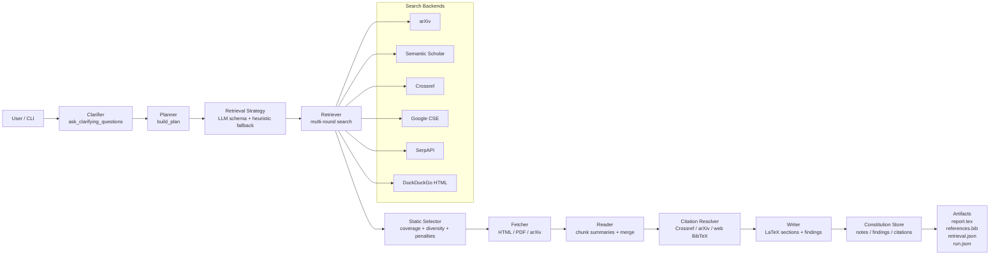
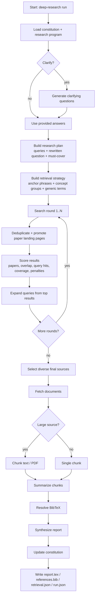
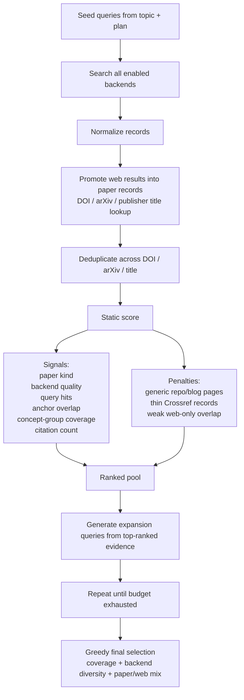

# Deep Research with Ollama

Local-first deep research pipeline built around Ollama, paper/web search, BibTeX resolution, and LaTeX report generation.

It asks clarifying questions, rewrites the topic into a tighter research brief, searches across multiple backends, reads large sources in chunks, resolves citations, keeps a persistent research constitution, and emits report artifacts you can inspect or edit.

## Current Status

The system is in a solid prototype state:

- Structured outputs are schema-driven per stage.
- Retrieval is now a hybrid of LLM-guided strategy plus static ranking and coverage heuristics.
- Large papers are chunked and summarized incrementally.
- The system keeps persistent research memory in `constitution.json` and `constitution.bib`.
- Broad or ambiguous topics are much better than before, but still weaker than narrow technical topics.

One important detail: the "agents" are currently role-based sequential stages, not parallel workers. The stages behave like specialized agents, but they execute in one pipeline.

## System Diagram



## Workflow Diagram



## Retrieval Loop



## What It Does

- Clarifies the task before research starts.
- Rewrites the request into a sharper research brief.
- Generates topic-specific retrieval strategy with schema-constrained LLM output and heuristic fallback.
- Searches `arXiv`, `Semantic Scholar`, `Crossref`, `Google CSE`, `SerpAPI`, or `DuckDuckGo HTML`.
- Promotes likely paper landing pages into canonical paper records when possible.
- Reads large PDFs and long documents in chunks.
- Resolves DOI-backed BibTeX via Crossref when possible.
- Falls back to arXiv or generated web BibTeX when needed.
- Stores findings, notes, and citations in a persistent constitution.
- Outputs LaTeX paragraphs plus a `.bib` file.

## Main Components

- [`cli.py`](/Users/kunpai/Documents/Playground/deep_research_ollama/src/deep_research_ollama/cli.py)
  Entry point and CLI commands.
- [`pipeline.py`](/Users/kunpai/Documents/Playground/deep_research_ollama/src/deep_research_ollama/pipeline.py)
  End-to-end orchestration: clarify, plan, retrieve, select, summarize, synthesize, write outputs.
- [`tools.py`](/Users/kunpai/Documents/Playground/deep_research_ollama/src/deep_research_ollama/tools.py)
  Search backends, dedupe, promotion, document fetching, chunking.
- [`ollama.py`](/Users/kunpai/Documents/Playground/deep_research_ollama/src/deep_research_ollama/ollama.py)
  Ollama client with schema-backed structured outputs.
- [`schemas.py`](/Users/kunpai/Documents/Playground/deep_research_ollama/src/deep_research_ollama/schemas.py)
  JSON Schemas for each LLM stage.
- [`citations.py`](/Users/kunpai/Documents/Playground/deep_research_ollama/src/deep_research_ollama/citations.py)
  BibTeX and cite-key resolution.
- [`constitution.py`](/Users/kunpai/Documents/Playground/deep_research_ollama/src/deep_research_ollama/constitution.py)
  Persistent findings, notes, and citation store.
- [`prompts.py`](/Users/kunpai/Documents/Playground/deep_research_ollama/src/deep_research_ollama/prompts.py)
  Role prompts for clarifier, planner, retrieval strategy, reader, and writer.
- [`program.py`](/Users/kunpai/Documents/Playground/deep_research_ollama/src/deep_research_ollama/program.py)
  Run-level editable `research_program.md` support.

## Artifacts

Each run writes:

- `report.tex`
  Final LaTeX report.
- `references.bib`
  BibTeX entries for selected citations.
- `retrieval.json`
  Search rounds, issued queries, ranking trace, and selected sources.
- `run.json`
  Full run snapshot including plan, selected sources, documents, citations, and synthesis payload.
- `constitution.json`
  Persistent memory of notes, findings, and citations.
- `constitution.bib`
  Persistent BibTeX memory.
- `research_program.md`
  Editable run-level instruction surface.

## Setup

1. Create a virtual environment and install the package.

```bash
cd /Users/kunpai/Documents/Playground/deep_research_ollama
python3 -m venv .venv
source .venv/bin/activate
pip install -e .
```

2. Make sure Ollama is running locally and the model exists.

3. Optional environment variables:

```bash
export OLLAMA_MODEL=gemma4:e4b
export GOOGLE_API_KEY=...
export GOOGLE_CSE_ID=...
export SERPAPI_API_KEY=...
export SEMANTIC_SCHOLAR_API_KEY=...
```

If neither Google CSE nor SerpAPI is configured, the pipeline falls back to DuckDuckGo HTML for web search.

## Usage

Interactive run:

```bash
deep-research run "retrieval-augmented generation for scientific assistants" \
  --output-dir /Users/kunpai/Documents/Playground/deep_research_ollama/output/rag_science
```

Non-interactive run:

```bash
deep-research run "retrieval-augmented generation for scientific assistants" \
  --no-clarify \
  --answer objective="compare RAG architectures for literature assistants" \
  --answer audience="ML engineers" \
  --answer constraints="prefer surveys, benchmarks, and production systems" \
  --output-dir /Users/kunpai/Documents/Playground/deep_research_ollama/output/rag_science
```

Show or modify the persistent constitution:

```bash
deep-research show-constitution \
  --output-dir /Users/kunpai/Documents/Playground/deep_research_ollama/output/rag_science

deep-research delete-citation smith2024rag \
  --output-dir /Users/kunpai/Documents/Playground/deep_research_ollama/output/rag_science

deep-research delete-finding finding-2 \
  --output-dir /Users/kunpai/Documents/Playground/deep_research_ollama/output/rag_science
```

Initialize the editable research program file:

```bash
deep-research init-program \
  --output-dir /Users/kunpai/Documents/Playground/deep_research_ollama/output/rag_science
```

Launch the local GUI:

```bash
deep-research gui \
  --host 127.0.0.1 \
  --port 8765 \
  --output-root /Users/kunpai/Documents/Playground/deep_research_ollama/output \
  --open-browser
```

The GUI launches the existing pipeline in a background subprocess, polls `run.json` and `constitution.json` for checkpointed progress, and lets you inspect `retrieval.json`, `report.tex`, `references.bib`, `constitution.json`, and `gui_run.log` from one page.

## Structured Outputs

The pipeline uses schema-driven outputs for the LLM stages:

- clarifying questions
- research planning
- retrieval strategy generation
- source-note summaries
- final synthesis

The Ollama client sends the schema through the `format` field and validates the returned object before the pipeline accepts it.

## Design Choices

- Retrieval is not purely LLM-ranked.
  Static scoring and greedy coverage selection are used so the search behavior is inspectable and less model-fragile.
- Search is multi-backend by default.
  This helps recover niche papers that may appear in Crossref or publisher pages but not arXiv or Semantic Scholar.
- Source memory is persistent.
  The constitution lets the system accumulate robust citation state across runs instead of rebuilding everything from scratch.
- Chunked reading is mandatory for large sources.
  This keeps local models usable on long PDFs and large HTML pages.

## Known Limitations

- Role-based "agents" are sequential, not parallel workers.
- Broad topics can still admit weak blog/tutorial/web sources.
- Crossref can surface noisy matches on ambiguous topics.
- Google Scholar is not integrated directly.
- The final writer is only as good as the local model; when it fails, the system falls back to source-note compilation.

## Suggested Next Improvements

- Parallel worker agents for retrieval, reading, and verification.
- Better venue-aware ranking for broad topics.
- More aggressive canonicalization of publisher landing pages.
- Domain-specific reranking passes for bio, materials, and policy topics.
- Better evaluation harnesses using saved `retrieval.json` traces.
