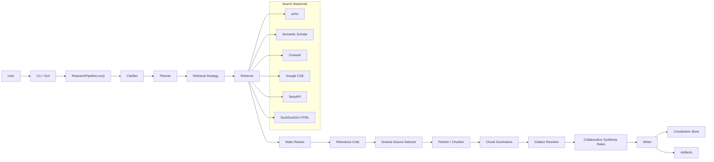
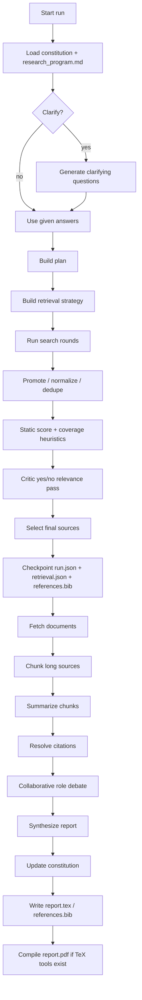

# H.A.S.H.I.L. (Heuristic Analysis & Synthesis for Highly Incoherent Literature)


Local-first research pipeline that runs topic clarification, multi-round retrieval, chunked reading, citation resolution, collaborative synthesis, and LaTeX/PDF report generation.

Model calls go through LiteLLM, so the same pipeline can run on local Ollama or remote providers such as Gemini, OpenAI, Anthropic, OpenRouter, NVIDIA NIM, Groq, Together, DeepInfra, Mistral, and others.

## What The Code Actually Does

- asks clarifying questions unless you skip them
- rewrites the topic into a research brief with `queries`, `must_cover`, `focus_areas`, and related topics
- builds a retrieval strategy with anchor phrases, concept groups, and generic-term penalties
- searches multiple backends over multiple rounds
- deduplicates and promotes paper landing pages into canonical paper records when possible
- scores results with static heuristics, then runs a critic pass that gives a yes/no relevance judgment from query + title + abstract/snippet
- selects a diverse final set of sources
- fetches HTML/PDF/arXiv content and reads long sources in chunks
- resolves citations into BibTeX
- runs a collaborative synthesis loop with evidence, skeptic, gap, and chair roles
- writes `report.tex`, `references.bib`, `retrieval.json`, `run.json`, `constitution.json`, `constitution.bib`, and usually `report.pdf`
- checkpoints aggressively and resumes incomplete runs from the same output directory

Important constraint: the "multi-agent" behavior is collaborative role prompting inside one pipeline. It is not true multi-process or multi-GPU parallel execution yet.

## Status

Current state is a strong prototype:

- provider/model routing is LiteLLM-based
- structured outputs are schema-driven per stage
- retrieval is hybrid: strategy generation + static ranking + critic filtering
- constitution state is persistent and now tracks metadata such as resume counts and confidence summaries
- the GUI can launch, stop, resume, inspect artifacts, render PDFs, and expose the main retrieval-budget knobs
- LaTeX compilation prefers Unicode-friendly engines and surfaces real TeX failure details

Still true:

- broad topics are weaker than narrow technical topics
- Google Scholar is best-effort, not an official API integration
- worker roles are sequential, not real parallel workers

## Architecture



## End-to-End Workflow



## Retrieval And Selection

The retrieval stack is not "let the model pick papers."

It does this:

- generates seed queries from the plan
- expands queries over multiple rounds
- deduplicates by DOI, arXiv id, and title similarity
- promotes publisher landing pages into paper records when possible
- statically scores for:
  - paper kind
  - backend quality
  - query-hit count
  - anchor phrase overlap
  - concept-group coverage
  - citation count
- penalizes:
  - generic repo/blog pages
  - thin Crossref-only records
  - weak web overlap
- runs a critic pass on the shortlist using query + title + abstract/snippet

The critic is a retrieval filter. It does not write the report. It only helps demote tangential sources before fetch/summarization.

## Collaborative Synthesis

Before final writing, the pipeline runs four role prompts:

- `EvidenceAgent`
- `SkepticAgent`
- `GapAgent`
- `ChairAgent`

These roles debate the gathered evidence and feed a collaboration snapshot into the final writer. This improves the final report, but it is still sequential orchestration inside one process.

## Checkpointing, Resume, And Constitution

Runs are resumable in the same output directory.

What is persisted:

- partial `run.json`
- partial `retrieval.json`
- partial `references.bib`
- incremental source-note / citation state in the constitution

The constitution is not just a dump of citations anymore. It now stores metadata such as:

- `resume_count`
- `resume_from_status`
- `last_checkpoint_stage`
- confidence summaries for citations, source notes, and findings
- per-record lifecycle metadata like `created_at`, `updated_at`, `last_seen_at`, and `seen_count`

Confidence is heuristic, not model-generated.

## Providers And Models

The provider layer lives in [`providers.py`](/Users/kunpai/Documents/Playground/deep_research_ollama/src/deep_research_ollama/providers.py).

What it supports:

- dynamic provider discovery from LiteLLM when available
- curated metadata for common providers
- suggested model lists for common providers
- freeform provider/model entry in the GUI, so you are not blocked by the suggestion list

Typical examples:

- Ollama:
  - provider: `ollama`
  - model: `gemma4:e4b`
- Gemini:
  - provider: `gemini`
  - model: `gemini-2.5-flash`
- NVIDIA NIM:
  - provider: `nvidia_nim`
  - model: `qwen/qwen3.5-122b-a10b`
  - api base: `https://integrate.api.nvidia.com/v1`

The pipeline internally resolves `provider + model` into LiteLLM's `provider/model` format if needed.

## GUI

The GUI is implemented in [`gui.py`](/Users/kunpai/Documents/Playground/deep_research_ollama/src/deep_research_ollama/gui.py).

It currently supports:

- provider input with suggestions
- model input with suggestions
- API key input for remote providers
- optional SerpAPI and Semantic Scholar keys for retrieval
- API base override
- start / stop / resume
- PDF rendering in the artifact viewer
- live status from checkpoints
- retrieval and summarization budget controls

The main knobs exposed in the GUI are:

- `Seed Queries`
- `Total Queries`
- `Search Rounds`
- `Selected Sources`
- `Web Results / Query`
- `Paper Results / Query`
- `Critic Shortlist`
- `Chunks / Source`
- `Summary Budget`

The GUI does not persist API keys to run artifacts. They are passed only through the launched subprocess environment.

## Artifacts

Each run can produce:

- `research_program.md`
  Editable per-run instruction surface.
- `report.tex`
  Generated LaTeX report.
- `references.bib`
  BibTeX for the selected citations.
- `report.pdf`
  Compiled PDF when TeX tools are available and compilation succeeds.
- `retrieval.json`
  Search rounds, ranking traces, query expansion, and selected sources.
- `run.json`
  Full run snapshot, progress, checkpoints, and LaTeX status.
- `constitution.json`
  Persistent notes, findings, citations, and metadata/confidence summaries.
- `constitution.bib`
  Persistent BibTeX memory.
- `gui_run.log`
  GUI subprocess output.

## LaTeX And PDF Generation

The report writer produces LaTeX source and then tries to compile a PDF.

Current behavior:

- prefers `latexmk`
- prefers `lualatex`, then `xelatex`, then `pdflatex`
- adds a more Unicode-tolerant preamble by default
- sanitizes problematic text before writing
- records the compile result in `run.json`
- surfaces the real fatal TeX error when compilation fails

If no TeX toolchain is installed, the run still succeeds at the research level and leaves `report.tex` plus `references.bib`.

## Main Files

- [`cli.py`](/Users/kunpai/Documents/Playground/deep_research_ollama/src/deep_research_ollama/cli.py)
  CLI commands, provider/model overrides, and knob overrides.
- [`config.py`](/Users/kunpai/Documents/Playground/deep_research_ollama/src/deep_research_ollama/config.py)
  Settings defaults, env loading, and research budgets.
- [`llm.py`](/Users/kunpai/Documents/Playground/deep_research_ollama/src/deep_research_ollama/llm.py)
  LiteLLM-backed chat/JSON client with schema validation.
- [`providers.py`](/Users/kunpai/Documents/Playground/deep_research_ollama/src/deep_research_ollama/providers.py)
  Provider metadata, model suggestions, and env wiring.
- [`pipeline.py`](/Users/kunpai/Documents/Playground/deep_research_ollama/src/deep_research_ollama/pipeline.py)
  End-to-end orchestration.
- [`tools.py`](/Users/kunpai/Documents/Playground/deep_research_ollama/src/deep_research_ollama/tools.py)
  Search, dedupe, fetch, promotion, and chunking.
- [`citations.py`](/Users/kunpai/Documents/Playground/deep_research_ollama/src/deep_research_ollama/citations.py)
  BibTeX and cite-key resolution.
- [`constitution.py`](/Users/kunpai/Documents/Playground/deep_research_ollama/src/deep_research_ollama/constitution.py)
  Persistent research memory.
- [`prompts.py`](/Users/kunpai/Documents/Playground/deep_research_ollama/src/deep_research_ollama/prompts.py)
  Prompt templates for all role stages.
- [`schemas.py`](/Users/kunpai/Documents/Playground/deep_research_ollama/src/deep_research_ollama/schemas.py)
  JSON Schemas for structured outputs.

## Installation

```bash
cd /Users/kunpai/Documents/Playground/deep_research_ollama
python3 -m venv .venv
source .venv/bin/activate
pip install -e .
```

## Environment Variables

Core model routing:

```bash
export LLM_PROVIDER=ollama
export LLM_MODEL=gemma4:e4b
export LLM_API_BASE=http://127.0.0.1:11434
export LLM_API_KEY=
```

Search backends:

```bash
export GOOGLE_API_KEY=
export GOOGLE_CSE_ID=
export SERPAPI_API_KEY=
export SEMANTIC_SCHOLAR_API_KEY=
export ENABLE_GOOGLE_SCHOLAR=1
```

Common provider-specific keys the app understands include:

- `OPENAI_API_KEY`
- `ANTHROPIC_API_KEY`
- `GEMINI_API_KEY`
- `GOOGLE_API_KEY`
- `OPENROUTER_API_KEY`
- `GROQ_API_KEY`
- `NVIDIA_NIM_API_KEY`
- `MISTRAL_API_KEY`
- `COHERE_API_KEY`

Search behavior:

- Google Scholar is queried as a paper backend on every run unless `ENABLE_GOOGLE_SCHOLAR=0`.
- with `SERPAPI_API_KEY`, Scholar uses SerpAPI's `google_scholar` engine first
- without SerpAPI, it falls back to direct Google Scholar HTML parsing
- if Google CSE and SerpAPI are not configured, general web search falls back to DuckDuckGo HTML
- Scholar hits carry cited-by counts and Scholar citation-export URLs, and citation resolution can use Scholar BibTeX when Crossref misses

## CLI Usage

Basic run:

```bash
deep-research run "retrieval-augmented generation for scientific assistants" \
  --provider gemini \
  --model gemini-2.5-flash \
  --output-dir /Users/kunpai/Documents/Playground/deep_research_ollama/output/rag_science
```

Non-interactive run:

```bash
deep-research run "retrieval-augmented generation for scientific assistants" \
  --no-clarify \
  --provider ollama \
  --model gemma4:e4b \
  --answer objective="compare RAG architectures for literature assistants" \
  --answer audience="ML engineers" \
  --answer constraints="prefer surveys, benchmarks, and production systems" \
  --output-dir /Users/kunpai/Documents/Playground/deep_research_ollama/output/rag_science
```

Example with NVIDIA NIM:

```bash
deep-research run "AI for hardware chip design" \
  --provider nvidia_nim \
  --model qwen/qwen3.5-122b-a10b \
  --api-base https://integrate.api.nvidia.com/v1 \
  --output-dir /Users/kunpai/Documents/Playground/deep_research_ollama/output/chip_design
```

Constitution commands:

```bash
deep-research show-constitution \
  --output-dir /Users/kunpai/Documents/Playground/deep_research_ollama/output/rag_science

deep-research delete-citation smith2024rag \
  --output-dir /Users/kunpai/Documents/Playground/deep_research_ollama/output/rag_science

deep-research delete-finding finding-2 \
  --output-dir /Users/kunpai/Documents/Playground/deep_research_ollama/output/rag_science
```

Initialize the run-level program:

```bash
deep-research init-program \
  --output-dir /Users/kunpai/Documents/Playground/deep_research_ollama/output/rag_science
```

Launch the GUI:

```bash
deep-research gui \
  --host 127.0.0.1 \
  --port 8765 \
  --output-root /Users/kunpai/Documents/Playground/deep_research_ollama/output \
  --open-browser
```

## Useful CLI Knobs

These overrides exist both in the CLI and, for the main ones, in the GUI:

- `--max-queries`
- `--max-total-queries`
- `--max-search-rounds`
- `--max-web-results-per-query`
- `--max-paper-results-per-query`
- `--max-selected-sources`
- `--max-critic-results`
- `--max-chunks-per-source`
- `--max-summary-model-calls`

Defaults in code today:

- `max_queries = 6`
- `max_total_queries = 14`
- `max_search_rounds = 3`
- `max_selected_sources = 8`
- `max_critic_results = 16`
- `max_chunks_per_source = 6`
- `max_summary_model_calls = 18`

## Structured Outputs

The pipeline uses schema-driven structured outputs for:

- clarifying questions
- planning
- retrieval strategy generation
- critic judgments
- source-note summaries
- collaborative worker turns
- chair summary
- final synthesis

The client asks LiteLLM providers for structured responses when supported and validates the returned objects locally either way.

## Limitations

- the collaborative roles are not true parallel workers
- retrieval still admits weak web sources on broad topics
- Crossref can still be noisy on ambiguous titles
- direct Google Scholar parsing is best-effort and may degrade under bot checks or markup changes
- search quality still depends heavily on query ambiguity and source availability
- the writer can still fall back to source-note compilation if the chosen model is weak or times out

## Summary

If you want the current mental model, it is this:

This project is a resumable local research engine with LiteLLM provider routing, heuristic-plus-critic retrieval, chunked document reading, collaborative report synthesis, persistent research memory, and LaTeX/PDF output. It is not yet a true parallel deep-research swarm, but it is already much more than a single prompt wrapped around search.
